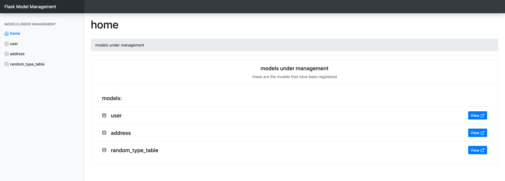
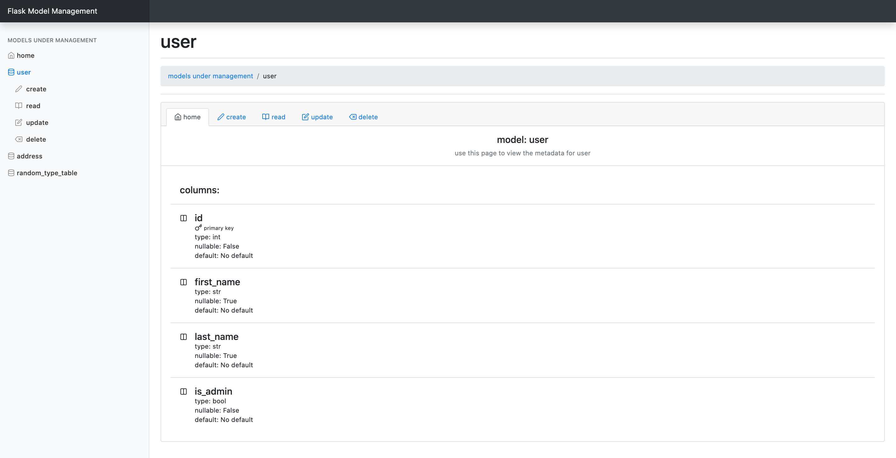
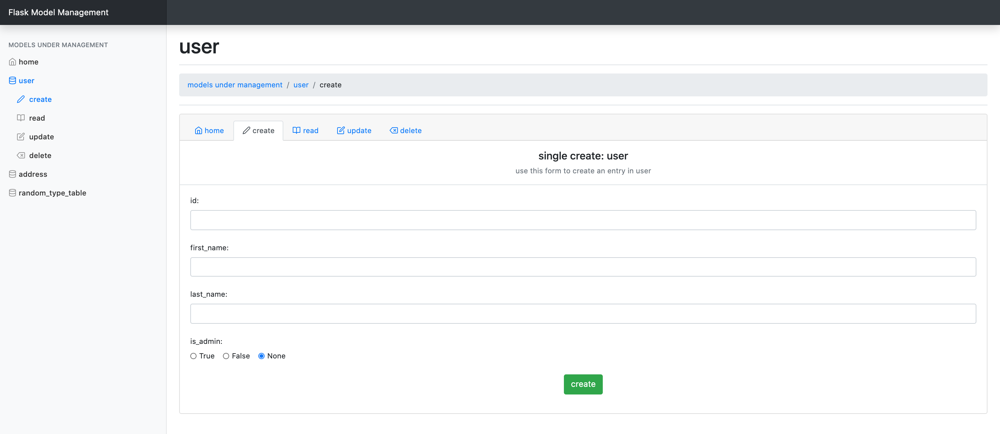
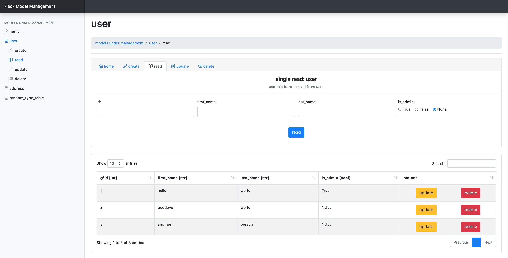
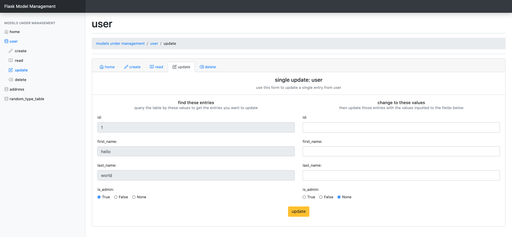
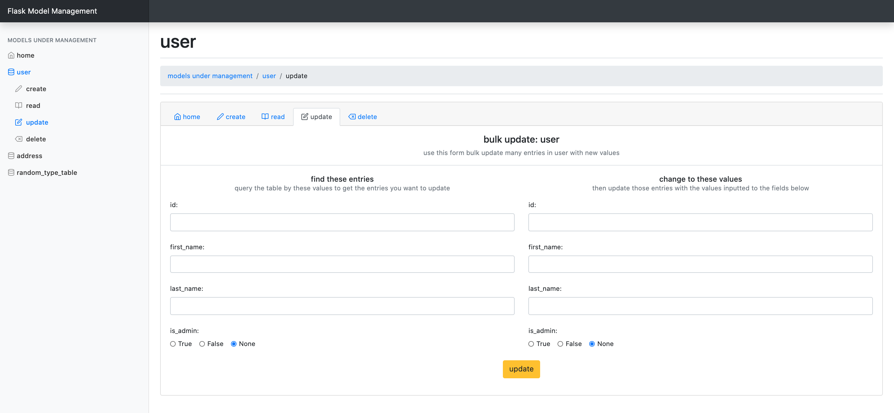
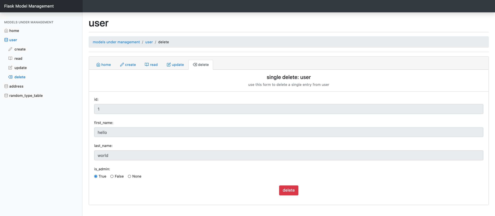
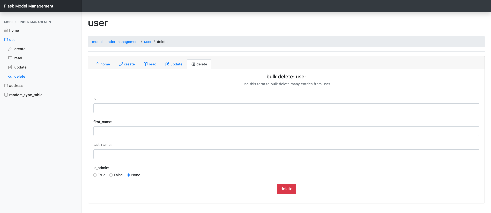

# Flask-Model-Management
* This is a Flask extension for managing Flask-SQLAlchemy models.
* This extension allows the user to perform CRUD (create, read, update, delete) operations on the models registered using the UI

The frontend is built using:
* Bootstrap4 (https://getbootstrap.com/)
* JQuery (https://jquery.com/)
* Datatables (https://datatables.net/)
* Feather Icons (https://feathericons.com/)
* This bootstrap theme (https://getbootstrap.com/docs/4.5/examples/dashboard/)
* Flatpickr for date(time) fields (https://flatpickr.js.org/)
* Jinja2

NB: all the above JS & CSS are bundled into this package currently


The backend is built using:
* Flask-SQLAlchemy & SQLAlchemy
* Flask-WTF & WTForms


# Status: In Alpha Development
BE WARNED: INSTALLING CRUD APPLICATIONS INTO PRODUCTION SERVERS ALLOWS USERS TO PERFORM POTENTIALLY IRREVERSIBLE DATA OPERATIONS

# Install
pip install:
```
pip install flask_model_management
```

# Use
* an example of how to use without app factory might look something like:
```
from flask import Flask
from flask_sqlalchemy import SQLAlchemy
from flask_model_management import ModelManager

app = Flask(__name__)
# from flask_sqlalchemy docs
app.config['SQLALCHEMY_DATABASE_URI'] = 'sqlite:////tmp/test.db'
db = SQLAlchemy(app)
model_manager = ModelManager(app, db)

# showing model declaration for the example
class User(db.Model):
    __tablename__ = "user"

    id = Column(Integer, primary_key=True)
    username = Column(String)

model_manager.register_model(User)
```


* with app factory:
```
from flask import Flask
from flask_sqlalchemy import SQLAlchemy
from flask_model_management import ModelManager

db = SQLAlchemy()
model_manager = ModelManager()

# showing model declaration for the example
class User(db.Model):
    __tablename__ = "user"

    id = Column(Integer, primary_key=True)
    username = Column(String, nullable=False)

def create_app():
    app = Flask(__name__)
    app.config['SQLALCHEMY_DATABASE_URI'] = 'sqlite:////tmp/test.db'
    db.init_app(app)
    model_manager.init_app(app, db)

    model_manager.register_model(User, nullable=False)
```


# UI Examples
* Home page


* Table page


* Create (single entry) page


* Read (bulk entries) page


* Update (single) page


* Update (bulk) page


* Delete (single) page


* Delete (bulk) page


# How it works
### frontend perspective
* Once you plug-in this extension then at: <YOUR-BASE-URL>/model-management/ you will find the home dashboard
* You can browse around the pages and perform CRUD operations on your models

### backend perspective
* A blueprint is added to your app called `model_management` with the url prefix `/model-management`
* 4 url routes are added to this blueprint:
  - A home page at: `/`
  - A table page at: `/<tablename>`
  - An operation page at: `/<tablename>/<operation>`
    - Operations limited to: create, read, update or delete
  - An operation API at: `/api/<tablename>`
    - CRUD operations are mapped to HTTP methods:
      - POST = create
      - GET = read
      - PUT = update
      - DELETE = delete
* The data from the frontend forms are then sent via ajax request to the operation API with the required data and HTTP method
* WARNING: this library will therefore wrap your Flask-SQLAlchemy models with an API endpoint
* There are 2 'protocols': single & bulk
  - single is for CRUD applied to one entry
    - always applied to: CREATE
    - sometimes applied to: UPDATE, DELETE
  - bulk is for CRUD applied to multiple entries (and is default in all but CREATE)
    - always applied to: READ
    - sometimes (default) applied to: UPDATE, DELETE

### Todo
* re-add decorators to models
* excluded columns
* excluded operations
