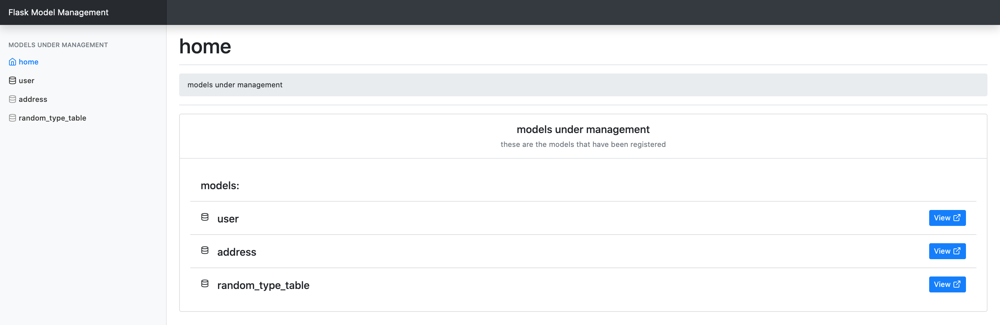

# Flask-Model-Management
This is a Flask extension for managing Flask-SQLAlchemy models
The frontend is built using:
* Bootstrap4 (https://getbootstrap.com/)
* JQuery (https://jquery.com/)
* Datatables (https://datatables.net/)
* Feather Icons (https://feathericons.com/)
* This bootstrap theme (https://getbootstrap.com/docs/4.5/examples/dashboard/)
* Flatpickr for date(time) fields (https://flatpickr.js.org/)
* Jinja2

NB: all the above JS & CSS are bundled into this package currently


The backend is built using:
* Flask-SQLAlchemy & SQLAlchemy
* Flask-WTF & WTForms

# UI
Home page



# Status: In Alpha Development
BE WARNED: INSTALLING CRUD APPLICATIONS INTO PRODUCTION SERVERS ALLOWS USERS TO PERFORM POTENTIALLY IRREVERSIBLE DATA OPERATIONS

# Install
* pip install:
```
pip install flask_model_management
```

# Use
* an example of how to use without app factory might look something like:
```
from flask import Flask
from flask_sqlalchemy import SQLAlchemy
from flask_model_management import ModelManager

app = Flask(__name__)
app.config['SQLALCHEMY_DATABASE_URI'] = 'sqlite:////tmp/test.db'
db = SQLAlchemy(app)
model_manager = ModelManager(app, db)

# showing model declaration for the example
class User(db.Model):
    __tablename__ = "user"

    id = Column(Integer, primary_key=True, autoincrement=True, nullable=False)
    username = Column(String)

model_manager.register_model(User)
```


* with app factory:
```
from flask import Flask
from flask_sqlalchemy import SQLAlchemy
from flask_model_management import ModelManager

db = SQLAlchemy()
model_manager = ModelManager()

# showing model declaration for the example
class User(db.Model):
    __tablename__ = "user"

    id = Column(Integer, primary_key=True, autoincrement=True, nullable=False)
    username = Column(String, nullable=False)

def create_app():
    app = Flask(__name__)
    app.config['SQLALCHEMY_DATABASE_URI'] = 'sqlite:////tmp/test.db'
    db.init_app(app)
    model_manager.init_app(app, db)

    model_manager.register_model(User, nullable=False)
```

# How it works
* Once you plug-in this extension then @ <YOUR-BASE-URL (e.g. http://127.0.0.1:5000)>/model-management/ you will find the home dashboard
